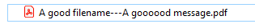
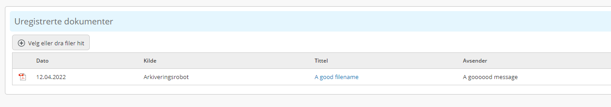
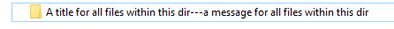
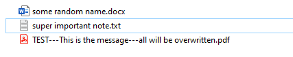
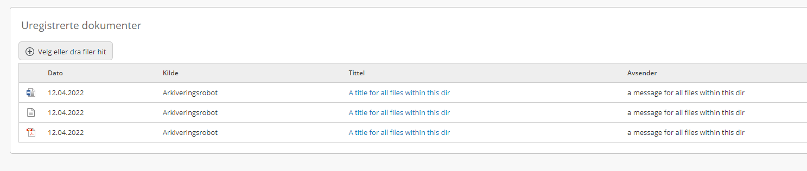

# send-to-arkivarer-for-handling
Easy tool for sending documents to manual archiving queue

## Install
```bash
git clone https://github.com/vtfk/send-to-arkivarer-for-handling.git
```
Navigate into the cloned repo in a terminal and run
```bash
npm i
```

## Configure
Setup your *.env* file
```bash
P360_URL="https://<server>:<port>.no/Biz/v2/api/call/SI.Data.RPC/SI.Data.RPC"
P360_KEY="secret-authkey"
INPUT_FOLDER=C:/toUnreg
#Optional
P360_ORIGIN_RECNO="recno from the codetable 'origin' in Public 360 Web Admin, if you don't know what it is, leave this blank and use the default"
DEFAULT_MSG="Set a default message that will be displayed on the file for arkivarer"
```

## Usage
### For single files
- Move files you want to send to manual archiving into the \<INPUT FOLDER>
- Rename the files to something that will be understandable for the archivists on the following form:
    - \<Filename>---\<Message (optional)>---\<OriginRecno (optional)>
    - If Message or originRecno is not set - default will be used, so usually all you need to set is a filename 
- You MUST use '---' as the delimiter in the filenames
- Run
```bash
node index.js
```
- Imported files are moved to \<INPUT FOLDER>/imported
- Failed files are moved to \<INPUT FOLDER>/error
- You will get notified in the console/terminal if something weird happens

#### Example
This input file



Will appear like this for the archivists



### For multiple files of the exact same type (folder import)
- Create a new folder like this: \<INPUT FOLDER>/folderImport/\<YOUR FOLDER> (create "folderImport" dir inside \<INPUT FOLDER> if it does not exist)
- Rename \<YOUR FOLDER> to something that will be understandable for the archivists on the following form:
    - \<Filename>---\<Message (optional)>---\<OriginRecno (optional)>
    - If Message or originRecno is not set - default will be used, so usually all you need to set is a filename 
- You MUST use '---' as the delimiter in the folder-name
- Move all the files you want to import into \<YOUR FOLDER>, these files can be named whatever you want - the folder name will override the filenames. 
- Run
```bash
node index.js
```
- Imported files are moved to \<INPUT FOLDER>/folderImport/<YOUR FOLDER>/imported
- Failed files are moved to \<INPUT FOLDER>/folderImport/<YOUR FOLDER>/error
- You will get notified in the console/terminal if something weird happens

#### Example
If you create a folder like this inside the 'folderImport'-directory



With these files inside the folder



It will appear like this for the archivists

